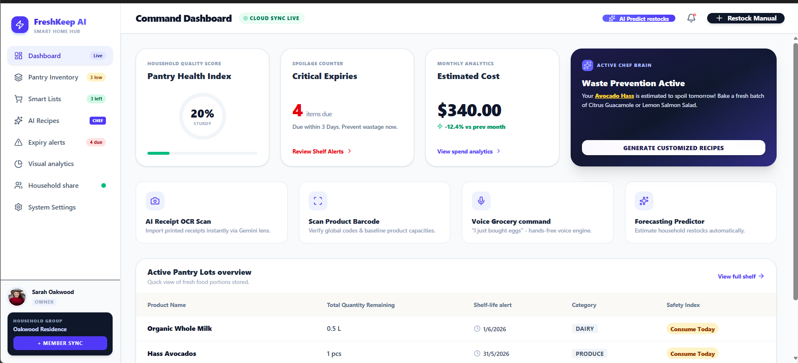
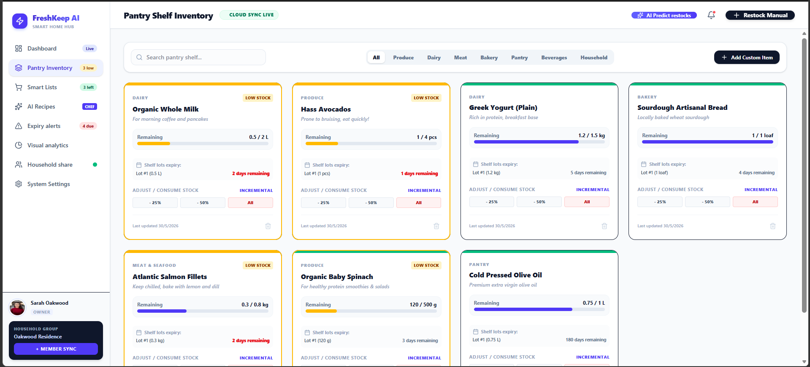
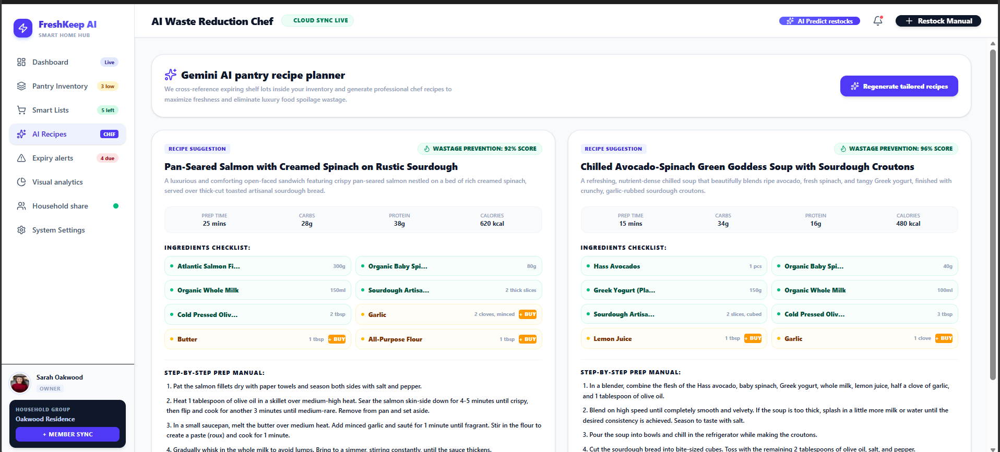
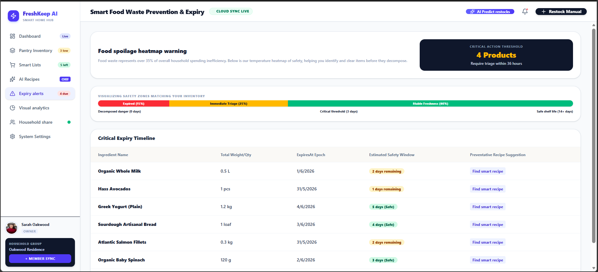
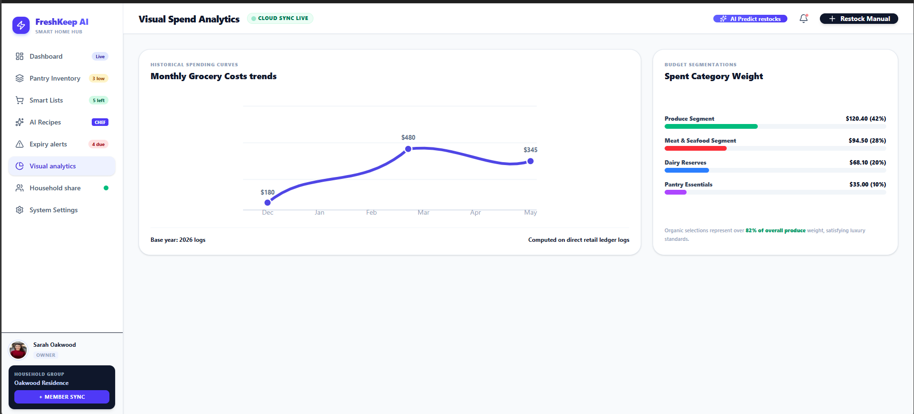

# 🍃 FreshKeep AI - Smart Grocery & Inventory Hub


> A production-grade, AI-powered Smart Home SaaS designed to eliminate food waste, predict grocery restocks, and generate dynamic culinary recipes based on real-time pantry inventory.



## 📖 Overview

FreshKeep AI brings Silicon Valley-level consumer software architecture into the smart home ecosystem. By combining multi-user household syncing with applied machine learning (Google Gemini), the platform actively monitors pantry shelf life, computes visual spending analytics, and acts as an "AI Waste Reduction Chef" to triage expiring ingredients.

---

## ✨ Core Product Features

### 1. AI-Powered Waste Reduction
* **AI Recipe Generation:** Cross-references expiring shelf lots within the user's inventory to generate professional chef recipes, maximizing freshness and eliminating luxury food spoilage.
* **Expiry Heatmap Protocol:** Categorizes inventory into dynamic safety zones (Immediate Triage vs. Stable Freshness), prompting critical action for items expiring within 36 hours.

### 2. Smart Inventory & Restock Forecasting
* **Lot-Traceability Matrix:** Tracks individual bulk sweeps down to the micro-lot level (e.g., matching a specific carton of milk to its exact expiration epoch).
* **Restock Prediction Engine:** Analyzes consumption velocities and alerts users when capacity drops below customizable percentage thresholds.
* **Simulated OCR & Voice Logging:** Capable of processing simulated receipt uploads and voice transcriptions to auto-populate high-volume inventory lots.

### 3. Household Cloud Sync
* **Multi-User Collaboration:** Role-based access control (Owner, Admin, Member) allowing synchronized family grocery checklists and real-time ledger edits.
* **Visual Spend Analytics:** Aggregates dynamic cost estimations and plots monthly grocery expenditure trends using interactive Cartesian charts.

---

## 🛠️ Tech Stack & Architecture

| Layer | Technologies Used |
| :--- | :--- |
| **Frontend UI** | React 19, TypeScript, Tailwind CSS, Motion |
| **State Management** | Centralized Hooks & Prop Drilling minimization |
| **Backend Integration** | Node.js / Express.js (Modular API routing for LLM calls) |
| **AI Processing** | Google Gemini Generative AI integration for recipe logic |
| **Data Layer** | Isolated In-Memory State (`db.ts`) simulating standard ORMs |

---

## 📸 Platform Gallery

### Command Dashboard

*High-level household metrics, active chef alerts, and spend tracking.*

### Pantry Shelf Inventory

*Granular lot-tracking with incremental adjustment controls and low-stock warnings.*

### AI Waste Reduction Chef

*Dynamic recipe generation utilizing at-risk ingredients to prevent spoilage.*

### Smart Expiry Heatmaps

*Visualizing safety zones and immediate triage timelines.*

### Visual Spend Analytics

*Historical spending curves and budget category weight segmentations.*

---

## ⚙️ Local Development Environment

1. **Clone the repository:**
   ```bash
   git clone [https://github.com/Vani691/freshkeep-ai.git](https://github.com/Vani691/freshkeep-ai.git)
   cd freshkeep-ai

2. **Install dependencies:**

   ```bash
   npm install

3. **Configure Environment Variables:** 
   Duplicate .env.example to .env and add your Gemini API Key:
   ```bash
   VITE_GEMINI_API_KEY="YOUR_KEY_HERE"

4. **Launch the Application:**
   ```bash
   npm run dev

The Vite development server will start the application locally.


Architected and Engineered by **Shravani Mane** Software Engineer specializing in Full-Stack Development and Applied AI.   